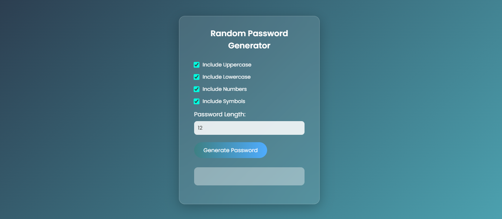
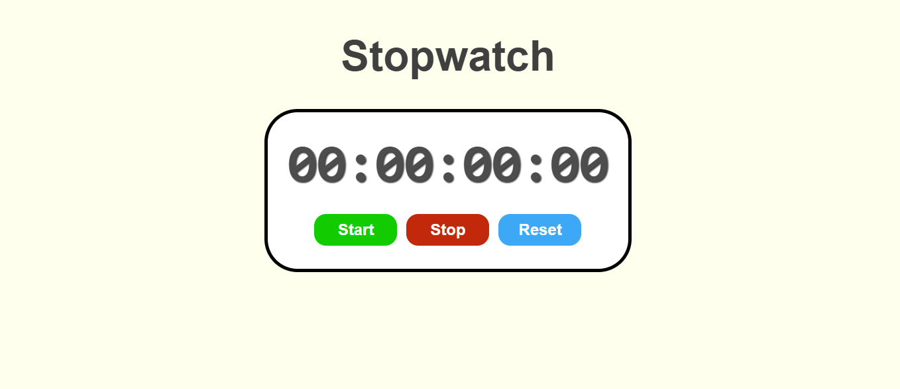

# JavaScript Mini Projects

This repository contains small JavaScript projects built to practice DOM manipulation and basic logic building.

## Projects

### 1. Password Generator
- Generates random passwords
- Allows choosing length and characters
- Simple, fast, and responsive

### 2. Stopwatch
- Start, pause, reset functionality
- Clean and minimal UI
- Accurate time tracking

## Tech Stack
- HTML
- CSS
- JavaScript
